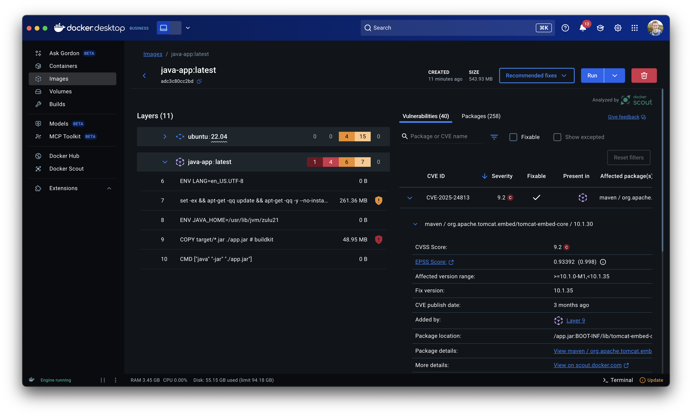
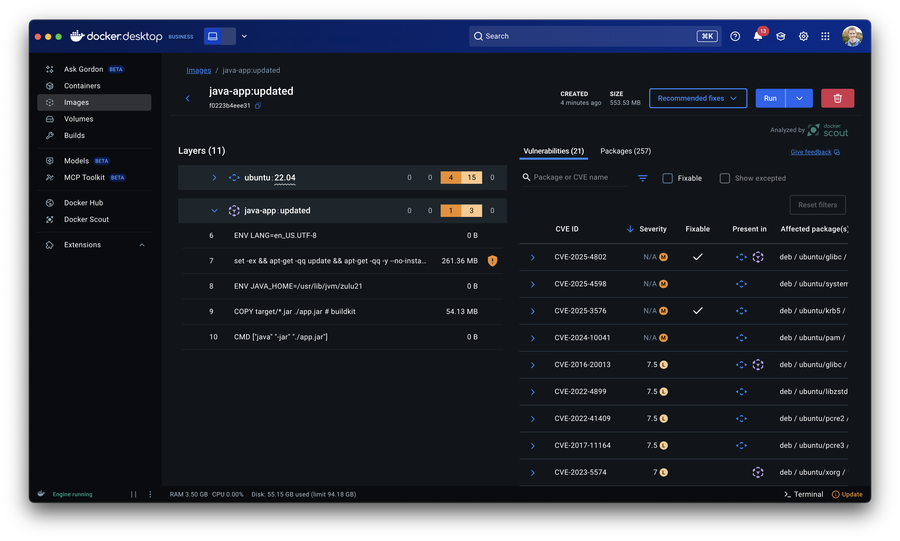

# Hands-on Four: Securing container images

## Learning objectives

In this hands-on, you will complete the following objectives:

- Learn how to use Docker Scout to identify and fix image issues

Let's get started!

> [!WARNING]
> This guide is not intended to cover _everything_ needed to secure your container images. Be sure to follow the guidance from your organization to ensure you are compliant with your organization's specific policies.


## Segment One: Getting container insights

Docker Scout provides the ability to perform point-in-time analysis of container images, but also the ability to continue monitoring the images in your registry.

For this workshop, we are simply going to focus on analyzing images built locally, identifying opportunities for improvement.

1. Let's start off by performing a build of our image again:

    ```console
    docker build -t todo-app .
    ```
   
    You'll notice a "What's next" suggestion in the output to use Docker Scout. 

2. Run the suggested command to look at Scout's recommendations:

    ```console
    docker scout quickview todo-app
    ```

   This may take a moment to run, as Scout will need to analyze the image, looking for the packages and dependencies found in the container image.

   You'll eventually get output similar to the following:

    ```plaintext
    Policy status  FAILED  (1/7 policies met, 2 missing data)
   
      Status │                     Policy                     │           Results            
    ─────────┼────────────────────────────────────────────────┼──────────────────────────────
      !      │ No default non-root user found                 │                              
      ✓      │ No AGPL v3 licenses                            │    0 packages                
      !      │ Fixable critical or high vulnerabilities found │    1C     4H     0M     0L   
      !      │ High-profile vulnerabilities found             │    1C     0H     0M     0L   
      ?      │ No outdated base images                        │    No data                   
             │                                                │    Learn more ↗                    
      ?      │ No unapproved base images                      │    No data                   
      !      │ Missing supply chain attestation(s)            │    2 deviations   
    ```

3. From here, you can dig into the specified CVE information by using the `docker scout cves` command:

    ```console
    docker scout cves java-app
    ```

    The output will highlight a `CRITICAL` vulnerability for `tomcat-embed-core`, which means we need to update the Spring Boot version.

4. Update the `pom.xml` file so the `parent` uses version `3.4.6` of `spring-boot-starter-parent`.

5. Perform a new build of the JAR file:

    ```console
    ./mvwn package -DskipTests
    ```
   
    This may take a little while since an all new set of dependencies will likely need to be downloaded.

6. Build a new container image:

    ```console
    docker build -t java-app:updated .
    ```
   
    This build adds a "tag" (or version) to the image, in this case `updated`.

7. Perform a scan of the new image:

    ```console
    docker scout quickview java-app:updated
    ```
   
    You should see a better report (note... other issues can have been published from the time of writing this workshop, so it's not guaranteed to be clear).

> [!TIP]
> Scout can do more than policy issues focused on vulnerabilities. It can also help with open-source license issues, ensuring only trusted base images are used, and more.


## Extra - using the Docker Desktop dashboard

You can also get much of the same insights using the Docker Desktop dashboard.

### Viewing the image vulnerabilities for the original image



### Viewing the fixed image



## Recap

In this hands-on, you accomplished the following:

- Used Docker Scout to find potential issues with an image
- Used Docker Scout to validate fixes were applied successfully
